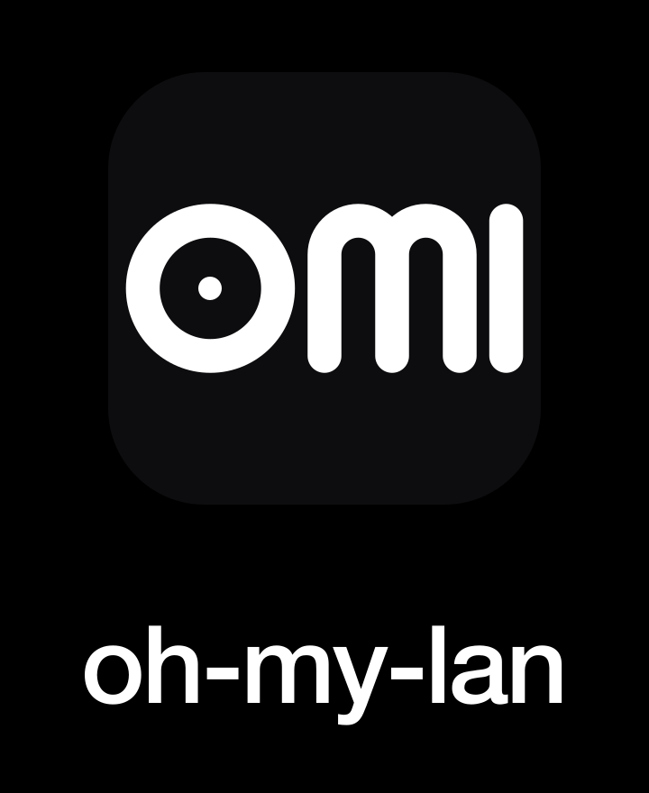

# oh-my-lan · Brand Book

按 svg-logo-designer 流程产出的视觉资产。所有 SVG 自包含、无外部字体依赖（wordmark 用 system font stack 渲染）。

## Visual System

| 元素 | 值 |
| --- | --- |
| 主背景 | `#000`（纯黑） |
| 浅色背景 | `#fff` |
| 主色（保留） | `#3b82f6 → #1e40af` 渐变（Web Admin accent 用） |
| Logo mark 笔画 | `#fff` 描边 stroke=80 round-cap round-join |
| 字符 visual band | y ∈ [312, 712]（viewBox 1024）— 三字母严格对齐到同一基线 |
| 圆角半径（icon） | 22.37% × 边长（macOS Big Sur HIG 风格） |

## Logo Mark

字母 lettermark **oml**（oh-my-lan 缩写），核心识别符号。

```
o    m    l
●   m    │
↑
中心节点：端点设备语义
```

| 字符 | 几何 | Visual 表现 |
| --- | --- | --- |
| `o` | circle r=160 + 中心实心圆 r=28 | 直径 visual 400 |
| `m` | 3 stems + 2 半圆拱（arch radius 80） | 宽 400 × 高 400 |
| `l` | 单条 vertical line（无 ascender） | 宽 80 × 高 400 |

三字母 Visual height 均为 400 — 几何严格对齐。`o` 中心嵌入的小圆点是品牌叙事钩子（network endpoint）。

## 资产清单

```
tauri/src-tauri/icons/
├── icon.svg              主图标源
├── icon.png              512px 通用
├── icon.icns             macOS 应用图标（10 尺寸合集）
├── icon.ico              Windows 应用图标（5 尺寸合集）
├── {16..1024}x{...}.png  全套单尺寸 PNG
└── concepts/             探索阶段产物（A/B/C 三档对比留档）

internal/server/web/
├── favicon.svg           浏览器标签页 favicon（vector）
└── favicon-32.png        浏览器 fallback

docs/branding/
├── horizontal.svg / .png  横向 lockup（icon + wordmark），README banner 用
├── vertical.svg   / .png  纵向 lockup，社媒 profile 用
├── icon-mono-light.svg/.png  反白版（白底黑字）
└── icon-mono-dark.svg /.png  描白版（透明背景，白字）
```

## Layout 用法

### Horizontal Lockup


适用：README header / Web 导航栏 / 业务文档头图。

### Vertical Lockup



适用：app store 截图 / 移动 splash / 社媒 profile 卡片。

### Icon Only

直接用 `tauri/src-tauri/icons/icon.svg` 或对应尺寸 PNG。适用：app 图标、favicon、小尺寸场合。

### Monochrome

- **Light**（白底黑字）：印刷品、报纸、单色文档
- **Dark**（透明白字）：任何深色 / 彩色背景叠加

## 字体规范

- **Wordmark**：system font stack
  ```
  -apple-system, BlinkMacSystemFont, 'SF Pro Display', 'Segoe UI', Inter,
  'Helvetica Neue', Helvetica, Arial, sans-serif
  ```
  weight 600，letter-spacing -4 (在 font-size=160 时)。
- **正文 / UI**：同样的 stack。Web Admin 已经统一用 system font，无外部字体依赖。

## 不可做的事

- ❌ 不要拉伸非等比缩放（毁视觉对齐）
- ❌ 不要给 mark 加阴影 / 描边 / 倒影
- ❌ 不要把 mark 旋转或镜像
- ❌ 不要在彩色/复杂背景上直接放 mark（请用 monochrome 变体）
- ❌ 不要换字母颜色（除了 monochrome 系列）

## 修改流程

改 logo 时只动一处：`tauri/src-tauri/icons/icon.svg`。然后：

```bash
make icons   # 自动派生 10 尺寸 PNG + .icns + .ico + favicon
make build   # omlserver embed 新 favicon
make tauri-bin   # Tauri binary 嵌入新 icon
```

Horizontal / Vertical lockup 等 `docs/branding/*.svg` 内嵌 icon 几何参数为 hardcoded copy；改 icon 时如果几何变化，**也需要同步更新这两份 SVG 里的 path**。后续如果迭代频繁可以让 `make icons` 自动 sync lockup 文件。

## 设计 rationale 留档

| 决策 | 理由 |
| --- | --- |
| 选 lettermark "oml" 而非纯图标 | 16px favicon 可读；远视稳定；可天然扩展成 wordmark；记忆点强 |
| 三字母严格几何对齐（不做 negative overshoot） | 用户偏好"看着一样大"的直觉一致性，优先于 typography 教科书的光学补偿 |
| `o` 中心嵌一个实心圆点 | 网络 endpoint 隐喻；视觉上又像 "o" 字母原本就有的注音点，不显违和 |
| 背景纯黑 | 用户偏好；macOS Dock 上 contrast 强；与项目控制台审美一致 |
| 笔画 stroke=80（占边长 7.8%） | 远视清晰 + 16px favicon 也认得出 |
| wordmark 用 system font 而非手撸 path | system font 质量稳定可控，避免在不同尺寸下 path 字形不协调；SVG 文件体积也更小 |
